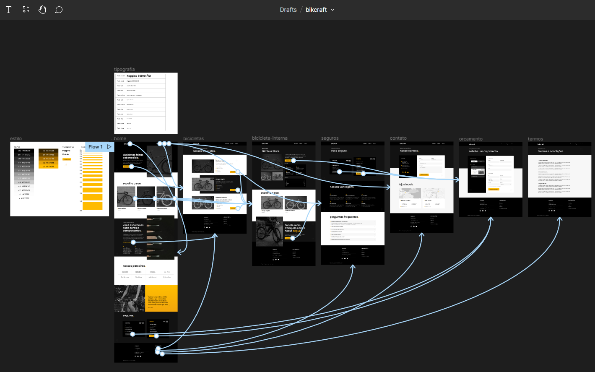

# Projeto didático: Bikcraft

## Sobre o projeto:

O projeto foi desenvolvido durante as aulas do curso de HTML e CSS para Iniciantes da Origamid. Utilizei HTML, CSS e JavaScript para criar um site de venda de bicicletas elétricas e serviços.

---

> ### Principais conceitos aplicados durante o desenvolvimento:

- Comandos para versionamento do código através de Git/Github;

- Uso adequados de tag html de acordo com a necessidade;

- Responsividade para acessar o site de desktop, tablets e smartphones;

- Exportar os elementos do design feito no Figma no curso de UI Design para Iniciantes;

- JavaScript básico para algumas funcionalidades de interação;

- Utilização alternativa de elementos como box-shadow.

> ### [Projeto desenvolvido no Figma](https://www.figma.com/proto/BH6NLmhcfIP30bdiwSSe6r/bikcraft?page-id=0%3A1&node-id=2%3A63&viewport=45%2C322%2C0.09&scaling=min-zoom&starting-point-node-id=2%3A63)
> 

  

